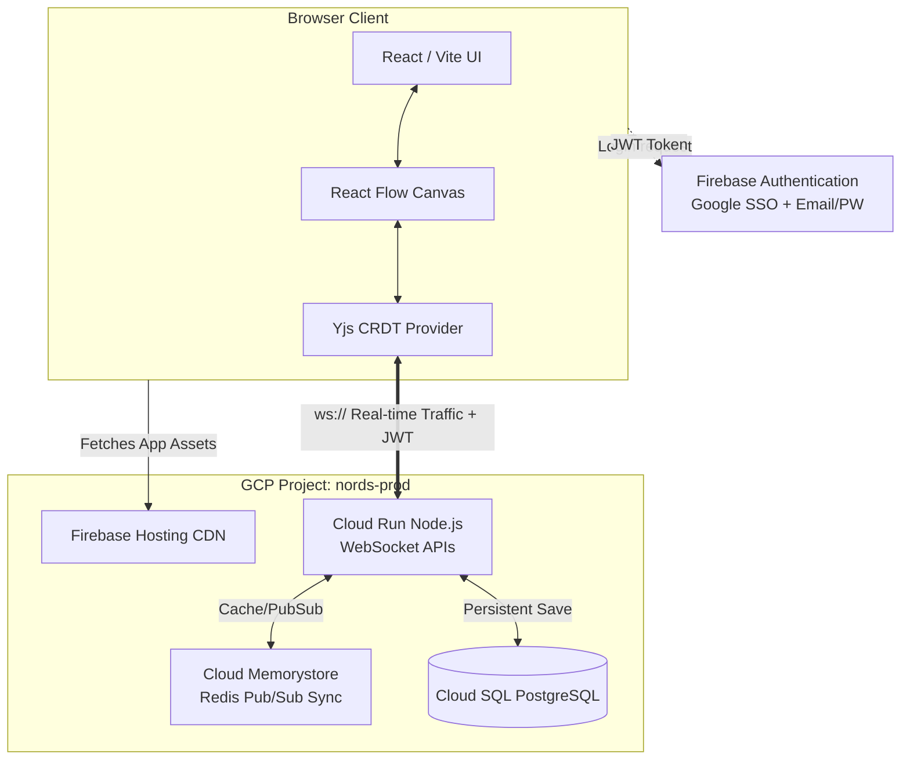

# 10. Technology & Infrastructure Architecture

This document defines the production technology stack, hosting infrastructure, and environment topology for the Nords engine. The overarching strategy is to natively leverage **Google Cloud Platform (GCP)** to minimize devops complexity while ensuring massive horizontal scalability for multiplayer WebSocket operations.

---

## 1. The Technology Stack

### Frontend & Rendering
* **Framework:** React 18+ powered by Vite.
* **Spatial Rendering Engine:** React Flow. 
  * *Why?* React Flow offers a battle-tested rendering loop and `ResizeObserver` node tracking out-of-the-box. 
  * *Constraint:* Default pathfinding edges are strictly bypassed. Nords relies exclusively on custom pure Euclidean edge math calculation (Quadratic Béziers, vector intersections) to preserve the Distance is Data invariant.
* **Styling:** Vanilla CSS with HSL logic for accessibility gating.
* **Component Strategy:** Functional components with aggressive memoization to maintain 60fps at scale.

### Backend APIs & Real-Time Sync
* **Runtime:** Node.js.
* **Multiplayer Paradigm:** Yjs (CRDTs - Conflict-free Replicated Data Types) operating over WebSockets.
  * This allows granular offline-first local states that natively resolve split-brain conflicts during multi-user editing without server-side deadlocks.

### Database Layer
* **Primary Store:** **Google Cloud SQL for PostgreSQL**.
* **Data Pattern:** Relational paradigms for User, Organization, and Project mapping. Graph-JSONB paradigms for standard spatial nodes (which update uniformly and continuously).

---

## 2. Infrastructure & Environments

Nords uses isolated GCP infrastructure ensuring identical architectures with fenced database operations.

### 2.1 The Two Environments
We utilize distinct GCP Projects to ensure hard IAM boundaries.

| Environment | GCP Project Name | Domain | Purpose |
|:---|:---|:---|:---|
| **Staging** | `nords-staging` | `nord-stage.monumental.ax` | QA, pre-release validation, developer integration. Nightly automated database scrubbing. |
| **Production** | `nords-prod` | `nords.monumental.ax` | Live customer traffic. Strict IAM access controls. Automated daily/hourly SQL backups. |

### 2.2 Google Cloud Toolchain
We rely heavily on GCP primitives:

1. **Google Cloud Run (Compute)**
   * **Role:** Hosts the Node.js API servers and WebSocket connection handlers.
   * **Why?** Serverless containers scale horizontally from 0 to N instantly, capable of spinning up sufficient capacity to match spiky multiplayer spatial canvas loads without static VM costs.
2. **Google Cloud SQL (Database)**
   * **Role:** Managed PostgreSQL hosting.
   * **Why?** Automated replication, failover, and maintenance. Directly compatible with Private IPs securely linked to Cloud Run deployments without leaving the GCP network.
3. **Firebase Hosting (Static Delivery)**
   * **Role:** Serves the compiled Vite/React application.
   * **Why?** Globally distributed, highly cached CDN optimized specifically for modern web app payloads. Seamless GitHub Actions deployment integration.
4. **Google Cloud Memorystore (State Syncing)**
   * **Role:** Redis service.
   * **Why?** When Cloud Run instances autoscale (e.g., from 1 instance to 10 instances), WebSocket traffic must still sync multiplayer data between clients connected to *different* instances. Redis serves as the Pub/Sub backbone mapping the distributed Yjs CRDT payloads across all nodes instantly.

---

## 3. Authentication & Security

Nords relies on **Firebase Authentication** natively linked into the overarching GCP project. This allows us to defer login cryptography, session management, and brute-force throttling to Google.

### Supported Methods
1. **Google Single Sign-On (SSO):** One-click ubiquitous authentication path.
2. **Standard Email / Password:** Traditional auth fallback.

### Security Gates
* **Email Validation Requirement:** To prevent spam generation and ensure secure environments, accounts created via the Email/Password strategy are placed in a soft-locked state until the user validates their email address via the native Firebase OTP verification email. Database write operations strictly check for `email_verified: true` in the authenticated Firebase JWT.
* **Role-Based Access Control (RBAC):** Token payloads embed standard Admin/Editor/Viewer metadata, consumed securely by both the Frontend UI boundaries and the Cloud Run backend guardrails. 

---

## 4. Logical System Architecture Diagram

---

## 5. Non-Functional Requirements (NFRs)

The Nords engine is subject to strict operational and performance thresholds to preserve the tactile "instant response" illusion of the physics canvas.

### 5.1 Performance & Responsiveness
* **Framerate Minimums:** The spatial canvas (React Flow) must sustain **60fps** during active panning, zooming, and isolated node dragging.
* **Canvas Density Ceiling:** The engine must fluidly render up to **5,000 Nodes** and their respective connections in a single workspace. This is achieved via strict Semantic Zoom thresholds (culling DOM elements at macro scales).
* **Network Latency (Multiplayer):** Yjs WebSocket CRDT synchronizations must broadcast and reconcile peer operational transforms within **50ms** p95 latency.

### 5.2 Scalability
* **Stateless API Tiers:** The Cloud Run environment must horizontally scale from 0 to N without degrading cross-client synchronization. All state must be reliably offloaded to Cloud Memorystore (Redis) Pub/Sub channels to bridge horizontal containers.
* **Database Concurrency:** Cloud SQL must remain abstracted behind robust connection pooling (handled within the Node API tier) to prevent connection exhaustion during traffic spikes.

### 5.3 Security & Compliance
* **Data in Transit:** All traffic (HTTPS / WSS) is encrypted via TLS 1.3.
* **Data at Rest:** All Postgres payloads stored in Google Cloud SQL rely on default Google storage-layer encryption (AES-256).
* **Session Management:** Auth tokens are provisioned via Firebase. Access tokens have a maximum lifespan of 1 hour, requiring silent refresh cycles linked to verified active sessions. 
* **Graph Access Constraints:** The backend must explicitly validate a user's Member Role against the target Workspace ID before resolving any WebSocket connection attempt or REST API query.

### 5.4 Availability & Reliability
* **Uptime Tiering:** The production infrastructure maps to a **99.9%** availability SLA.
* **Database Failover/Backups:** The production Cloud SQL instance relies on High Availability (HA) configurations with automated daily rolling backups and Point-In-Time-Recovery (PITR) enabled.
* **Snapshot Resilience:** Operational keyframes (Snapshots) are immutable. Deletions or schema modifications to Live graphs never cascade destructively into historical Snapshots.
