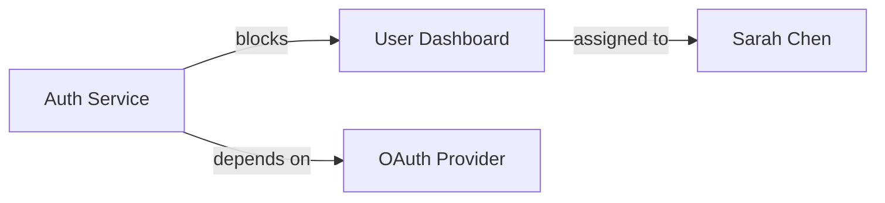
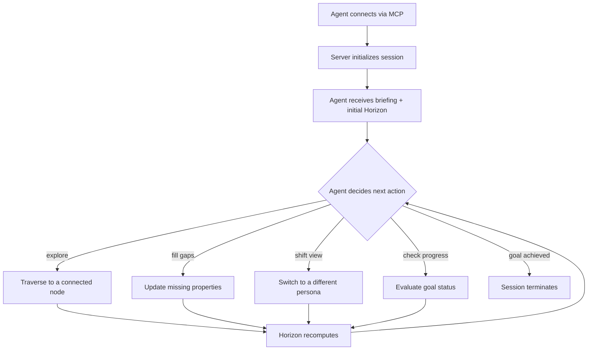

# AI Integration (MCP Server)

> A session-based Model Context Protocol server that gives AI agents a sense of place, progress, and purpose — transforming them from text generators into graph-navigating collaborators.

---

## Overview

Nords exposes its entire knowledge graph to AI agents through a native **Model Context Protocol (MCP) server.** This isn't a read-only API or a data dump — it's a session-based protocol that gives the AI a *sense of place.*

When an AI agent connects, it enters a **session.** It has a position in the graph, an active persona, and a live **Horizon** — a real-time view of what's nearby, what's incomplete, what's blocked, and what goals are within reach. The agent navigates the graph the way a team member would: moving between nodes, filling in gaps, switching perspectives, and working toward objectives.

The result is an AI that doesn't just answer questions about your project — it **works inside it.**

---

## The Problem

- **AI gets messy text dumps with no structure.** When teams share project context with AI, the AI receives flat documents — meeting notes, spec pages, spreadsheet exports. It has no graph to traverse, no typed relationships, no spatial semantics. It can summarize, but it can't reason about dependencies, proximity, or flow.
- **Building AI integrations requires bespoke context injection every time.** Every team that wants AI to understand their project builds a custom pipeline: scrape data, format it, inject it into a prompt, hope the AI interprets it correctly. There is no standard protocol for handing a structured knowledge graph to an AI agent.
- **Agents can't share understanding.** When one AI agent learns about a project structure, that understanding dies with the session. The next agent starts from scratch. There is no persistent, structured context layer that multiple agents — or the same agent across sessions — can navigate and build on.

---

## User Stories

- **As a product team,** I want to connect an AI assistant to our project graph so it can help fill in missing specs, identify blocked goals, and suggest next steps — without us having to manually brief it every time.
- **As a developer,** I want to connect my IDE's AI agent to Nords so it understands the project structure, priorities, and what I should work on next.
- **As a knowledge manager,** I want an AI to autonomously walk through our knowledge base, identify gaps, and surface incomplete nodes for human review.
- **As a project admin,** I want to control whether AI agents can only read the graph or also create and modify data, so I can manage risk.
- **As an integration builder,** I want any MCP-compatible client (Claude, Cursor, custom agents) to connect to Nords using a standard protocol and per-project tokens.

---

## Key Capabilities

| Capability | Description |
|------------|-------------|
| **20+ MCP tools** | Three tiers: **read-only** (graph queries, dictionary, goals), **session** (traverse, visit, update, switch persona), and **mutable** (create/update/delete nords and connections). |
| **Dual-Payload Translation** | Every time the AI reads the canvas, it receives two complementary representations: a **Mermaid.js semantic layer** (topology, flow, dependencies) and a **JSON spatial layer** (schemas, matrix buckets, exact `0.0–1.0` values). This leverages the LLM's native training on both formats. |
| **Permission Parity** | AI agents possess the exact same operational permissions as standard human users. They can mutate the canvas, alter Nord schemas, and manage Snapshots — gated by the same access token scopes (Read-Only, Read-Write, Admin). |
| **Tiered access control** | Mutable tools are gated by a project-level flag. Project admins decide whether AI agents can modify the graph or only navigate it. |
| **Session-based navigation** | The AI operates in a stateful session with a current position, active persona, and visited-node history — not a stateless query interface. |
| **Horizon computation** | At every step, the server computes what's around the agent, what's incomplete, and what goals are actionable — the AI's real-time situational awareness. |
| **Goal-driven workflows** | AI sessions can be scoped to specific goals. The session ends when the goal is achieved, enabling focused, objective-driven automation. See [[Goals]]. |
| **Persona inheritance** | When the AI switches persona, it inherits the weights, voice, and motivation — reshaping both its priorities and communication style. See [[Persona Lens]]. |
| **External client support** | Any MCP-compatible client can connect using per-project access tokens. See [[Access Tokens]]. |

---

## The AI Traversal Loop

MCP injects a structured traversal protocol into the connected agent's system prompt. This ensures the AI builds understanding progressively rather than requesting the entire graph at once:

| Step | Action | Tool | Purpose |
|------|--------|------|---------|
| **Step 0** | Semantic Deduction | `nords_get_dictionary` | Read the project's ontology — Nord types, Connection types with stage labels, personas — to understand the workspace's vocabulary *before* walking the data. |
| **Step 1** | Macro Topology | `nords_get_graph` | Get the compressed graph overview. Understand the shape of the project: clusters, key nodes, overall topology. |
| **Step 2** | Targeted Discovery | `nords_get_nord` | Drill into specific nords identified in Step 1. Read full markdown descriptions, properties, and metadata. |
| **Step 3** | Micro Traversal | `nords_traverse_connection` | Trace specific vectors outward from a target node. Explore the 1-hop neighborhood to understand local context and adjacencies. |

This progressive disclosure pattern — *dictionary → topology → detail → neighborhood* — prevents context window flooding and ensures the AI reasons about the right scope at each stage.

---

## Dual-Payload Translation

Because external LLMs are text-based, the Nords engine can't just dump x/y coordinates into context. It uses a highly optimized **Dual-Payload** translation:

### The Semantic Layer (Mermaid.js)
The backend compiles active Nords and Connections into a Mermaid string. This leverages the LLM's native training to grasp topology, dependencies, and flow instantly.



### The Spatial Layer (JSON)
A structured JSON array providing explicit schemas, matrix buckets, and the exact `0.0–1.0` normalized value of all active connections.

```json
{
  "connections": [
    {
      "from": "Auth Service",
      "to": "User Dashboard",
      "type": "Blocks",
      "distance_x": 0.85,
      "stage": "Critical Blocker"
    }
  ]
}
```

The dual-payload approach gives the AI both **structural intuition** (from Mermaid) and **precise data** (from JSON) in a single read.

---

## Real-Time Physics Interaction

When an AI agent updates the `0.0–1.0` value of a connection via MCP, the change doesn't just update the database — it triggers the force-directed physics engine on the user's [[Spatial Canvas]] in real time. Connected nords animate to their new positions live, making the AI's actions visible and intuitive to the human watching.

This is the core of the human-in-the-loop design: the human sees what the AI is doing spatially, and can intervene by dragging, disconnecting, or editing — steering the AI's logic by reshaping the space it operates in.

---

## Key Interactions

### AI Session Lifecycle



### The Horizon Object

Every time the AI acts, the server returns an updated **Horizon** containing:

| Field | Description |
|-------|-------------|
| **Current position** | The nord the agent is currently visiting |
| **Persona** | The active persona and its category weights |
| **Neighbors** | Connected nords, weighted by the active persona's priorities |
| **Incomplete properties** | Required fields on the current nord that have no value |
| **Goal status** | Which goals are blocked, achievable, or achieved — and what's needed to advance them |
| **Visited history** | Which nodes the agent has already visited in this session |

### Tool Tiers

| Tier | Tools | Access |
|------|-------|--------|
| **Read-only** | `nords_get_graph`, `nords_get_dictionary`, `nords_get_goals`, `nords_get_horizon`, `nords_query_nords`, `nords_get_connections` | Always available |
| **Session** | `nords_traverse_connection`, `nords_visit_nord`, `nords_update_session_nord`, `nords_switch_persona`, `nords_reset_session` | Available in active sessions |
| **Mutable** | `nords_create_nord`, `nords_update_nord`, `nords_delete_nord`, `nords_create_connection`, `nords_update_connection`, `nords_delete_connection` | Gated by project flag |

---

## Technical Notes

- Server implementation: `server/src/mcp-server.ts`
- Full tool reference and detailed schema: see [[MCP Integration]]
- Session state is maintained server-side; clients are stateless.
- Horizon computation runs on every tool call that changes position, properties, or persona.
- Mutable tool access is controlled via a per-project boolean flag in project settings.
- Access token authentication is checked before any tool execution. See [[Access Tokens]] for token management.
- Just-In-Time Refreshing: before the AI executes a write operation, the MCP Server auto-refreshes the Dual-Payload so the AI acts on real-time coordinates.
- The AI defaults to the "Live Canvas State" — historical Snapshots are only loaded when explicitly requested, keeping context windows lean.
