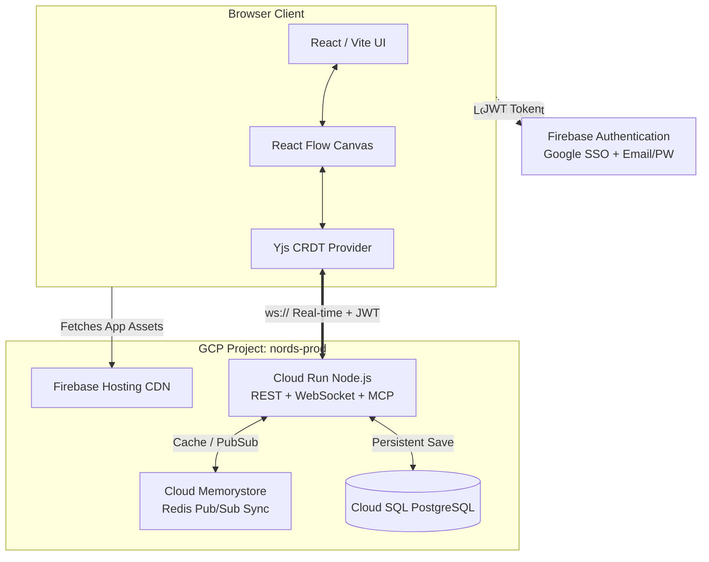
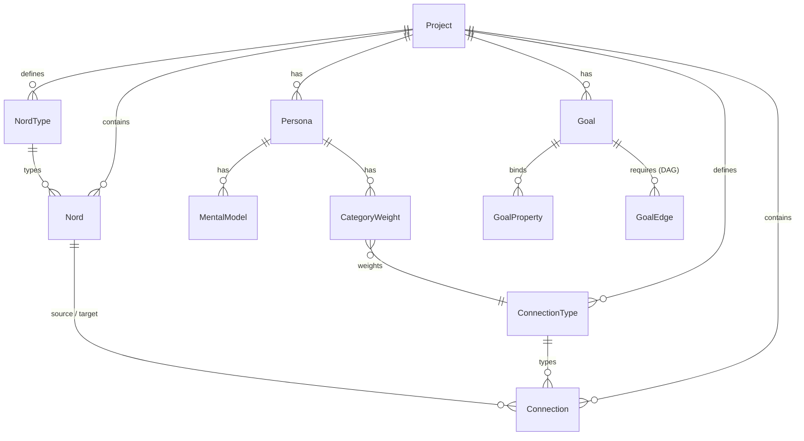

# Architecture

> **A spatial graph engine built for humans and AI.** React + React Flow canvas, Node.js + MCP backend, PostgreSQL graph storage — deployed on GCP with Firebase auth.

---

## Overview

Nords is a full-stack spatial graph application. The frontend renders an interactive canvas of typed node cards with physics-driven edge connections. The backend exposes both a REST API and an MCP (Model Context Protocol) server, giving AI agents the same structured access to the graph that the UI has. Everything is deployed on Google Cloud Platform with Firebase handling auth and static hosting.

This page covers the technology stack, infrastructure topology, data model, key subsystems, competitive positioning, constitutional invariants, and non-functional requirements.

---

## Constitutional Invariants

Four unbending rules that prevent architectural drift during implementation:

| # | Invariant | Rule |
|---|-----------|------|
| **1** | **Distance is Truth** | A connection's geometric distance is the single source of truth. The UI stage label is a calculated projection of that distance, never the underlying stored value. |
| **2** | **Absolute vs. Relative** | A nord's relative position is governed by the active force-directed physics engine. Its absolute resting X/Y coordinates are explicitly saved per Snapshot — nodes don't lose their place if physics is toggled off. |
| **3** | **MCP is the Bridge** | The MCP server is the one and only permitted bridge between the spatial graph and an AI context window. Any feature that reads or writes the graph through AI must go through the MCP surface. Session context is attached to entities, not floating in chat history. |
| **4** | **Three Primitives, One Graph** | Nords, ConnectionTypes, and Personas are peers. No primitive is subordinate to another. Any entity can connect to any other through any ConnectionType. This universality is what makes the graph traversable. |

---

## Stack

| Layer | Technology | Notes |
|-------|-----------|-------|
| Frontend | React 19, Vite, TypeScript | Strict mode, `noUnusedLocals`, functional components with aggressive memoization |
| Graph Canvas | React Flow v12 | Custom nodes, custom Euclidean edge math (no pathfinding), semantic zoom |
| Styling | Vanilla CSS with HSL logic | Accessibility gating via HSL color math |
| Backend | Node.js, Express, TypeScript | REST API + MCP server |
| Real-Time Sync | Yjs (CRDTs) over WebSockets | Offline-first, conflict-free multiplayer editing |
| Database | PostgreSQL (Cloud SQL) | Relational for users/orgs/projects; JSONB for dynamic graph schemas |
| Cache / PubSub | Redis (Cloud Memorystore) | Cross-instance WebSocket sync for horizontal scaling |
| Auth | Firebase Authentication | Google SSO + email/password with email verification |
| AI | Gemini (via Firebase AI Logic) | Multi-model: 2.0 Flash, 2.5 Flash, 2.5 Pro |
| Protocol | MCP SDK (`@modelcontextprotocol/sdk`) | stdio transport |
| Static Hosting | Firebase Hosting | Global CDN for compiled Vite/React app |
| Compute | Google Cloud Run | Serverless containers, 0-to-N autoscaling |

---

## Infrastructure Topology

Nords runs entirely on **Google Cloud Platform** with hard IAM boundaries between environments:



| Environment | GCP Project | Domain | Purpose |
|-------------|-----------|--------|---------|
| **Staging** | `nords-staging` | `nord-stage.monumental.ax` | QA, pre-release validation, nightly DB scrubbing |
| **Production** | `nords-prod` | `nords.monumental.ax` | Live traffic, strict IAM, automated daily/hourly backups |

### GCP Services

| Service | Role | Why |
|---------|------|-----|
| **Cloud Run** | Node.js API + WebSocket handlers | Serverless containers scale 0-to-N — handles spiky multiplayer canvas loads without static VM costs |
| **Cloud SQL** | Managed PostgreSQL | Automated replication, failover, and maintenance. Private IP linked to Cloud Run — stays inside GCP network |
| **Firebase Hosting** | Static Vite/React delivery | Global CDN, GitHub Actions CI/CD integration |
| **Cloud Memorystore** | Redis Pub/Sub | When Cloud Run scales from 1 to N instances, Redis syncs Yjs CRDT payloads across all containers |
| **Firebase Auth** | Login, sessions, RBAC | Defers cryptography, brute-force throttling, and session management to Google |

---

## Repository Layout

```
nords/
├── client/          # React frontend (Vite)
│   └── src/
│       ├── components/
│       ├── context/     # LensContext, TypeRegistryContext, AuthContext
│       ├── hooks/       # useProjectGraph, useDrawerEntity, useCameraFly …
│       └── utils/
├── server/          # Express API + MCP server
│   └── src/
│       ├── repositories/  # Data access layer (nords, connections, sessions …)
│       ├── routes/        # REST API endpoints
│       ├── lib/           # toolDispatch, goalEvaluator, horizon …
│       └── mcp-server.ts  # MCP stdio adapter
└── docs/
    └── wiki/        # This documentation
```

---

## Data Model

*See [[Data Model]] for the full deep-dive and [[API Reference]] for the REST schema.*



### Three Primitives

| Primitive | Role | Spatial Encoding |
|-----------|------|-----------------|
| **Nord** | Typed node card (task, idea, person, risk) | Scale (0.0–1.0) → card width |
| **Connection** | Typed edge with direction and distance | distance_x + distance_y (each 0.0–1.0) |
| **Persona** | AI/human lens with weighted priorities | CategoryWeights per ConnectionType |

All three are **peers in the graph** — any entity can connect to any other through any ConnectionType. All three are **MCP-accessible** — AI agents traverse, query, and mutate the entire graph.

---

## Key Subsystems

### Spatial Canvas Engine
Built on React Flow v12. Custom node types:
- `NordNode` — standard record card with handles
- `GoalNode` — circle node for goals lens
- `PersonaCenterNode` — avatar at radial centre
- `PersonaZoneNode` — concentric weight rings

Semantic zoom tiers (`micro` / `meso` / `macro`) are applied via `data-zoom-tier` on `<html>` and drive CSS rules for showing/hiding detail. The canvas enforces **Euclidean purity** — all edges use direct geometric paths or Quadratic Bézier arcs. No pathfinding or edge routing (see Invariant 1).

### Lens System
`LensContext` holds the active lens mode (`canvas | board | persona | goals`) and all related state (active connection type, active persona, hidden types). `GlobalDock` writes to it; canvas components read from it.

Switching lenses triggers **The Reveal** — a fluid physics-based animation where cards fly between positions, letting users track where nodes moved.

### MCP Tool Dispatch
`server/src/lib/toolDispatch.ts` routes all MCP tool calls through a single typed handler. Each tool validates its arguments with Zod and calls the appropriate repository. The `ToolContext` carries `sessionId`, `projectId`, `mcpMutable`, and `mcpCaptureData` flags. See [[MCP Integration]] for the full tool reference.

### Goal Evaluator
After every `nords_update_session_nord` call, the goal evaluator checks whether any bound properties have crossed their completion threshold. It emits `goal_events` (achieved, blocked, prerequisite_unblocked, session_terminated, exclusion_triggered). See [[Goals]].

### Session Horizon
Computed server-side per tool call. Combines:
- Current nord + its completion status
- Connected nords weighted by active persona's `CategoryWeight` map
- Incomplete required properties
- Active goal states

See [[AI Integration]] for details on how the Horizon shapes AI behavior.

---

## Competitive Positioning

| | **Miro** | **Trello / Notion** | **Raw Graph DB** | **Nords** |
|---|---------|-------------------|-----------------|-----------|
| **Data Model** | Drawing — shapes with visual connectors | Column-based (Trello) or page-based (Notion) | Pure graph with query language | Typed spatial graph with visual canvas |
| **Edge Semantics** | None — connectors carry no meaning | None — relationships are implicit | Full — but requires Cypher/SPARQL | Full — distance, direction, stages, properties |
| **AI Access** | None — no MCP surface | Limited — API-only, no graph traversal | API — but requires query expertise | Native — MCP with session state and Horizon |
| **User Accessibility** | High — familiar drawing tool | High — familiar list/page tool | Low — requires technical expertise | High — card/canvas UX wrapping graph power |
| **Queryability** | Can't query "show me everything blocking Q3" | Filter by column/tag only | Full graph queries | Structured queries via MCP tools + visual filtering |

### Why Not Miro?
Miro's data model is a drawing — shapes on a canvas with visual connectors. Nords' data model is a graph — typed nodes with typed, semantically-rich relationships. Miro can't query "show me everything that blocks the Q3 launch" because its connectors carry no meaning.

### Why Not Trello / Notion?
They are column-based or page-based. A card lives in one list. A page lives in one hierarchy. Nords exist in a network where the same entity participates in many relationships, each with its own spatial language — and every relationship is machine-readable.

### Why Not a Raw Graph Database?
Neo4j and its peers are powerful but require query languages and technical expertise. Nords wraps graph thinking in a canvas/card UX that anyone can use. You don't write Cypher — you drag a card between columns and the graph updates.

---

## Defensibility

The combination of four capabilities creates a product experience that cannot be replicated by adding features to a drawing tool, a kanban board, or a graph database:

1. **Per-Category Spatial Semantics** — Each ConnectionType defines its own measurement system with independent X/Y stages and adjustable breakpoints. This is not a single "relationship" concept — it's a rich vocabulary of spatial relationships.
2. **MCP-Native AI Traversal** — AI agents don't read a text dump; they traverse a structured graph with session state, weighted priorities, and computed Horizon. The MCP surface is the architecture, not a bolt-on.
3. **Three-Primitive Relational Model** — Nords, Connections, and Personas are peers in one graph. No primitive is subordinate. This universality enables traversal patterns that siloed tools cannot express.
4. **Animated View Transitions (The Reveal)** — Switching lenses triggers physics-based animations where cards fly between positions. This makes the data model *visible* — users see the spatial meaning, not just read it.

---

## Target User

### Primary Persona
People working at the intersection of human decision-making and AI capability:
- **Project managers, innovation leads, and strategists** who need to externalize complex relationship thinking
- **AI-forward professionals** who want their tools to generate context that AI agents can actually use
- **Anyone outgrowing flat tools** — they need relationships, intensity, direction, and structured knowledge, not just lists

### Day-One User
Someone who has tried to make Trello + Miro + ChatGPT work together and feels the friction of context evaporating between tools. They want one place where they can think visually, organize relationally, and hand context to AI seamlessly.

### Triggering Event
*"I have a project where the relationships between things matter more than the sequence, and I need my AI to understand those relationships — not just read my notes."*

### Path to Mass Market
The AI-native PM is the wedge, not the ceiling. The viral loop is **Nord DNA** — shareable MCP-accessible project graphs that make any AI tool smarter. Non-technical teammates adopt because their AI-native colleague says "just put it in Nords so Claude can see the whole picture."

---

## Security Model

| Layer | Implementation |
|-------|---------------|
| **Data in Transit** | All traffic (HTTPS / WSS) encrypted via **TLS 1.3** |
| **Data at Rest** | All PostgreSQL payloads in Cloud SQL use Google storage-layer encryption (**AES-256**) |
| **Authentication** | Firebase Auth with Google SSO and email/password. Email verification required before write access. |
| **Session Tokens** | Firebase JWTs with 1-hour max lifespan, silent refresh for active sessions |
| **Authorization** | **RBAC** — token payloads embed Admin/Editor/Viewer roles, consumed by both frontend UI boundaries and Cloud Run backend guardrails |
| **Graph Access** | Backend validates user's Member Role against target Workspace ID before resolving any WebSocket connection or REST query |
| **Email Verification** | Accounts created via email/password are soft-locked until `email_verified: true` in the Firebase JWT. No database writes without verification. |

---

## Non-Functional Requirements

### Performance & Responsiveness

| Metric | Target |
|--------|--------|
| **Canvas Framerate** | **60fps** during panning, zooming, and node dragging |
| **Node Density** | Fluid rendering up to **5,000 nodes** with connections (via semantic zoom culling) |
| **Multiplayer Latency** | Yjs WebSocket CRDT sync within **50ms p95** |

### Scalability

- **Stateless API:** Cloud Run scales 0-to-N horizontally. All state offloaded to Redis Pub/Sub for cross-container sync.
- **Connection Pooling:** Database concurrency managed via connection pooling in the Node.js API tier to prevent exhaustion during spikes.

### Availability & Reliability

| Metric | Target |
|--------|--------|
| **Uptime SLA** | **99.9%** |
| **Database Backups** | Automated daily rolling backups + Point-In-Time Recovery (PITR) |
| **Snapshot Resilience** | Immutable — deletions and schema changes to live graphs never cascade into historical snapshots |
| **Failover** | Cloud SQL High Availability (HA) with automated failover |

---

## Related Pages

| Page | Description |
|------|-------------|
| [[Data Model]] | Three primitives, Distance = Data paradigm, spatial semantics, physics engine |
| [[Property-Types]] | Full catalog of 14 property types, Stage deep-dive, NordType/ConnectionType options |
| [[Templates and Onboarding]] | Project initialization, template system, standard library, onboarding flow |
| [[Glossary]] | Consolidated definitions of all Nords terminology |
| [[MCP Integration]] | MCP tool reference, session lifecycle, Horizon and Goal Events |
| [[API Reference]] | REST endpoints and schema |
| [[Product Features]] | PRD-style breakdown of every major capability |
| [[Development Guide]] | Setup, build, test, contribution workflow |
