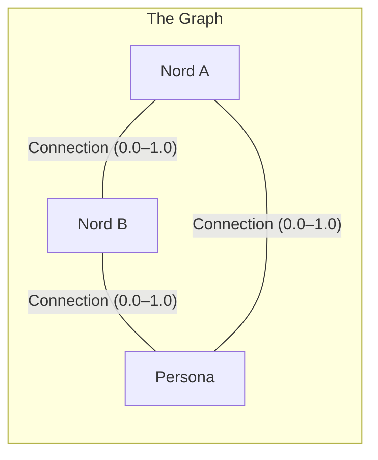
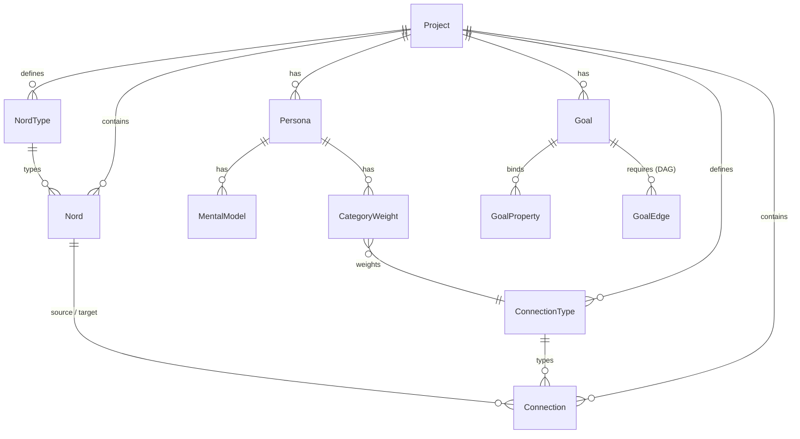

# Data Model

> **Distance is data.** Every relationship in Nords carries spatial meaning — proximity on the canvas is the single source of truth.

---

## Overview

Nords is a spatial graph engine built on a single insight: **physical distance encodes meaning**. Instead of storing relationships as flat foreign keys or tag associations, Nords maps every connection to a continuous 0.0–1.0 scale with user-defined semantic labels. Drag two cards closer and the data updates. Change a dropdown and the cards move.

This is what makes Nords a graph you can *see* — not a graph you query. The data model is designed to be simultaneously human-readable (cards on a canvas) and machine-traversable (typed nodes and edges with structured properties, exposed over [[MCP Integration]]).

---

## The Problem

- **Knowledge tools store flat records.** Tasks live in lists, notes live in pages — the spatial relationships between ideas exist only in your head. No tool captures how tightly two things are coupled, or how far apart they've drifted.
- **AI gets messy text dumps.** Without structured relationships, AI assistants receive a wall of context and can't distinguish what's connected, what's blocking, or what matters most.
- **Decisions are invisible.** The reasoning behind "why is this task near that milestone?" disappears the moment someone closes the whiteboard.
- **Fragmented tools lose signal.** Moving between a drawing tool, a kanban board, and a chat window means context decays at every handoff.

---

## User Stories

| # | Persona | Story |
|---|---------|-------|
| 1 | **Product Manager** | As a PM, I want to drag a feature card closer to a milestone so my AI agent understands the coupling strength without me writing a status update. |
| 2 | **Engineering Lead** | As a tech lead, I want to define a "Blocks" connection type with stages like `Hard Blocker → Soft Dependency → Independent` so the team has a shared vocabulary for dependency severity. |
| 3 | **AI Agent (via MCP)** | As an AI agent, I want to traverse typed edges with numeric distances so I can compute which nodes are most tightly coupled to my current position — not guess from unstructured text. |
| 4 | **Strategy Consultant** | As a strategist, I want to snapshot the graph at key decision points so I can animate through the project's evolution and show stakeholders how priorities shifted over time. |
| 5 | **New Team Member** | As a new hire, I want to see orphan nords floating at the canvas edges so I immediately know which work items aren't connected to any goal or milestone. |

---

## Key Capabilities

| Capability | Description |
|-----------|-------------|
| **Three Primitives** | Everything is a Nord (typed node), a Connection (typed edge), or a Persona (AI/human lens). All three are peers in the graph — any entity connects to any other. |
| **Distance = Data** | A connection's geometric distance on the canvas is the stored 0.0–1.0 value. The UI label is a projection, never the source of truth. |
| **Dual-Axis Spatial Encoding** | Connections carry independent X and Y distances, each with their own stage labels. This powers the [[Board View]] as a spatial pivot table. |
| **Semantic Stages** | User-defined text labels (e.g., `Blocker → In Progress → Done`) partition the 0.0–1.0 scale into qualitative regions with adjustable breakpoints. |
| **Directionality Modes** | Four arrow modes — `neither`, `start`, `end`, `both` — control edge semantics. Setting `neither` disables spectrum values entirely. |
| **Force-Directed Physics** | A continuous physics simulation treats connections as springs. Conflicting distances auto-resolve to equilibrium. |
| **Immutable Snapshots** | Time-stamped keyframes capture exact coordinates, distances, and metadata. Read-only — like Git commits for your graph. |
| **Soft Deletes** | Removing a property hides it from the live canvas but preserves it in historical snapshots. Schema drift is detected on restore. |

---

## The Three Primitives

1. **Nords** — Typed node cards representing any entity: tasks, ideas, decisions, risks, people. Each Nord inherits its property schema from its [[Property-Types|NordType]].
2. **Connections** — Typed edges linking any two entities. Each connection carries direction, distance_x (0.0–1.0), distance_y (0.0–1.0), and custom properties defined by its ConnectionType.
3. **Personas** — Graph-native representations of people, roles, or AI agents. Personas participate in the same connection system as Nords — they are not metadata bolted on top.

> [!IMPORTANT]
> **Invariant 4 — Three Primitives, One Graph:** No primitive is subordinate to another. Any entity can connect to any other entity through any ConnectionType. This universality is what makes the graph traversable.

---

## Entity Hierarchy

| Entity | Description |
|--------|-------------|
| **Project** | Top-level container. Owns all types, entities, personas, and goals. |
| **NordType** | Schema definition for nords. Defines properties, icon, color, scale behavior. |
| **ConnectionType** | Schema definition for connections. Defines direction default, X/Y stage labels, properties. |
| **Nord** | Instance of a NordType. Carries property values, position coordinates, and session state. |
| **Connection** | Instance of a ConnectionType linking two entities. Carries distance_x, distance_y, direction, and properties. |
| **Persona** | AI lens configuration with MentalModel and CategoryWeights. See [[Persona Lens]]. |
| **Goal** | Structured objective bound to property thresholds. See [[Goals]]. |

---

## Spatial Semantics

### Distance X & Distance Y

Every connection can encode meaning on two independent axes:

| Axis | Range | Drives | Example |
|------|-------|--------|---------|
| **distance_x** | 0.0–1.0 | Horizontal canvas position · [[Board View]] columns | `To Do (0.0) → In Progress (0.5) → Done (1.0)` |
| **distance_y** | 0.0–1.0 | Vertical canvas position · [[Board View]] rows | `Low (0.0) → Medium (0.5) → High (1.0)` |

Each axis gets its own **Stage Property** — an ordered set of labels that partition the continuous scale into human-readable regions. Labels are evenly distributed by default, but breakpoints are adjustable via draggable slider handles in the ConnectionType editor.

### Bi-Directional Sync

The spatial paradigm is enforced in both directions:

- **Canvas → Data:** Drag two nords apart → distance_x recalculates in real-time → the stage label updates automatically.
- **Data → Canvas:** Change a dropdown from "In Progress" to "Done" → the physics engine forces the nords to the corresponding physical position.

### Per-Type Normalization

Each ConnectionType maintains its own independent 0.0–1.0 scale. The 1.0 maximum is bound to a hard pixel limit (2,500px at 100% zoom). Dragging beyond this stretches the visual line but caps the semantic distance at 1.0 — preventing outliers from compressing all other values.

---

## Directionality Modes

Each connection instance supports one of four arrow configurations:

| Mode | Visual | Behavior |
|------|--------|----------|
| **Neither** (default) | `A — B` | A simple bond, no arrows. **Disables distance_x and distance_y** — the connection is metadata-only with no spatial encoding. |
| **Start** | `A ← B` | Arrow at the source. The source is the "subject" of the relationship. |
| **End** | `A → B` | Arrow at the target. The target is the "subject" of the relationship. |
| **Both** | `A ↔ B` | Arrows at both ends. Fully bidirectional — distance is a shared value applied equally. |

> [!NOTE]
> The `neither` mode is critical: it allows connections to exist purely as metadata associations (e.g., "related to") without spatial implications. At least `start`, `end`, or `both` must be set before spatial editing is meaningful.

---

## Force-Directed Physics Engine

Because nords exist in 2D space with many-to-many relationships, distance values will naturally encounter geometric constraints. The physics engine resolves these continuously:

- **Spring Model:** Connections act as springs holding the 0.0–1.0 tension between nodes.
- **Auto-Equilibrium:** Forcing a nord into a position that conflicts with its other connections triggers rebalancing — connected nords pull or relax to the equilibrium state.
- **Collision Avoidance:** In dense clusters, localized repulsion fields prevent node overlap.
- **Zero-Gravity:** A nord with no active connections floats freely at its absolute resting coordinates.
- **Fluid Undo:** `CMD+Z` rewinds the displacement animation smoothly, preserving the user's spatial mental model.
- **Euclidean Purity:** Lines are direct geometric paths (straight or Quadratic Bézier arcs). No pathfinding or edge routing — artificial length added to dodge obstacles would corrupt the distance data.

> [!IMPORTANT]
> **Invariant 1 — Distance is Truth:** A connection's geometric distance is the single source of truth. The UI stage label is a calculated projection of that distance, never the underlying stored value.

---

## Snapshots & History

### Immutable Snapshots

A Snapshot is a read-only keyframe of the entire project graph at a precise moment:

- **Scope:** Exact coordinates, all distance values (0.0–1.0), every property value on every Nord and Connection.
- **Immutability:** Snapshots are strictly read-only — like Git commits for the spatial graph.
- **Creation:** Taken from the Global Dock (available in all lens modes) or from Project Settings → Snapshots.
- **Playback:** "Animate Through All" triggers a chronological sequence with 1.5-second easing transitions between states.

### Soft Deletes

To prevent corrupting historical snapshots when schemas change:

- Deleting a property hides it from the live canvas and future instances.
- Legacy snapshots still retrieve the archived field gracefully.
- **Schema Drift Detection:** Restoring a historical snapshot to the live canvas triggers a prompt — re-activate missing schema fields or strip the relic.

### Snapshot Diffing

- **Split-Screen:** Two snapshots side-by-side with synchronized pan/zoom.
- **Overlay:** Single canvas with color-coded annotations — green (added), red (removed), amber (spatially shifted).
- **Delta Summary:** Plain-text sidebar listing all changes (e.g., *"'API Integration' moved from 0.2 to 0.8 on the Blocker scale"*).

### Full Export (RAG Context)

The entire project exports as a structured document optimized for LLM context windows: project metadata, all nords with properties, all connections with distances and stage labels, graph topology (Mermaid), spatial coordinates, comments, and snapshot metadata. Available in Markdown, JSON, and YAML from **Project Settings → Full Export**.

---

## Technical Notes

- **Storage:** PostgreSQL with JSONB for dynamic property schemas. Relational patterns for users, orgs, and project mapping; graph-JSONB for spatial nodes and edges.
- **Source:** `server/src/repositories/` — data access layer for nords, connections, sessions, snapshots.
- **Invariant 2 (Absolute vs. Relative):** A nord's relative position is governed by the physics engine. Its absolute resting X/Y coordinates are explicitly saved per snapshot — nodes don't lose their place if physics is toggled off.
- **Related pages:** [[Architecture]], [[Property-Types]], [[Board View]], [[Spatial Canvas]], [[MCP Integration]]
