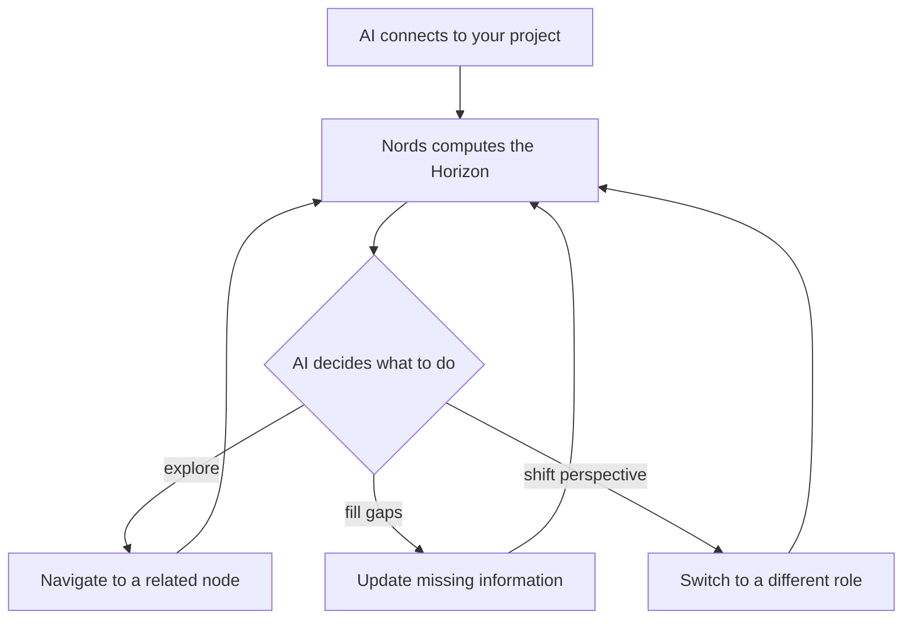

# Nords

> **A visual loop space that makes Graph RAG accessible to everyone.** Inspired by Figma's freedom, built from the ground up for human-in-the-loop AI collaboration. A shared canvas where you shape knowledge, and AI agents run stateful loops alongside you.

---

## What is Nords?

Nords is **a visual loop space** designed to make Graph RAG (Graph Retrieval-Augmented Generation) accessible to everyone, not just database engineers. Inspired by the freeform design of tools like Figma, Nords is built from the ground up for human-in-the-loop AI collaboration.

Rather than treating AI as a search tool or a simple text generator, Nords positions the AI as an active **collaborator**. 

You drag cards onto a canvas and draw lines to connect them. You define what things exist in your project — features, people, milestones, or choices — and how they relate. But unlike a static design tool, every card you place and every line you draw is a live data point. 

This visual layout builds a structured Graph RAG network in real time. It gives your AI collaborator a clear, visual map to follow. They can see where they are, what is complete, what is blocked, and what they need to do next. It transforms the AI into a teammate working on the same page, with you staying in control to guide them.

---

## The Problem

Teams build valuable knowledge every day, but current tools throw the structure away.

Documents are just long pages of text. Spreadsheets are just rows. Task trackers are just lists. None of them show how things actually connect. 

This is a major problem for AI. When you ask an AI assistant to help, it receives a giant, messy dump of text. It has no sense of direction. It cannot tell which tasks are blocked, which milestones are close, or what matters most to your role. It can summarize your project, but it cannot help you run it.

Meanwhile, Graph RAG — the key to giving AI accurate, context-aware memory — remains locked behind technical walls. Building one requires database engineers and query languages. Working with one day-to-day is impossible for non-technical teams.

---

## The Solution

Nords solves this by bringing four capabilities together on a single visual canvas:

### 1. Visual Graph RAG (Retrieval-Augmented Generation)
Instead of giving an AI a long document to read, Nords connects your data points in a graph. This is Graph RAG made simple. It helps the AI understand the relationships between your ideas, which makes its answers accurate and prevents it from making mistakes. You build this complex graph visually just by drawing lines.

### 2. Stateful AI Agents (Working How They Should)
Nords does not treat AI like a simple chatbot. When an AI connects to your canvas, it enters a live **session**. It has a position on the map, a role, and a clear view of its surroundings (its **Horizon**). The AI can navigate from card to card, fill in missing details, and work toward goals.

This balance allows the AI to work exactly how it should: **neither too rigid nor too loose.** Traditional automation forces AI into rigid, hardcoded paths that break easily. Chatbots are too loose and quickly wander off track. Nords creates a flexible playground with clear guardrails. The AI has the freedom to reason creatively, but it is naturally kept on track by the graph's connections, validation rules, and goals.

### 3. Visual Loop Space (Human-in-the-Loop)
Nords is built around the human-in-the-loop cycle. You can watch AI agents navigate and update the canvas in real time. If an agent goes off track, you don't have to rewrite a complex prompt. You simply drag a card, disconnect a link, or edit a property. By physically arranging the space, you steer the agent's logic.

### 4. One Map, Many Lenses
Because the canvas is backed by real data, you can view your project in different ways. Switch from the canvas to a kanban board, a timeline, or a role-based heatmap instantly. The data stays the same; only the view changes.

---

## Who Is Nords For?

Nords is built for **AI-forward PMs, strategists, and teams outgrowing flat tools.** The day-one user is someone who's already making Trello + Miro + ChatGPT work together with duct tape — pasting context into prompts, manually syncing boards, and wishing the AI could just *see* the project. If you've ever copy-pasted a Kanban board into a chat window so an AI could help you plan, Nords replaces that entire workflow with a single canvas where structure and AI coexist natively.

---

## How Nords Is Different

- **vs. Miro:** Miro is a drawing app. Its connectors are visual lines — they carry no data, no stages, no distance values. You can't ask "show me everything 70% complete" because the lines don't know what 70% means. In Nords, every connection is a typed, queryable data point.
- **vs. Trello:** Trello cards live in exactly one column. Move a card to "In Review" and it stops being "In Progress." In Nords, a single Nord can be at different stages on different relationship types simultaneously — 80% done on the engineering track, 30% on the legal review.
- **vs. Raw graph databases:** Neo4j and friends are powerful, but they require Cypher or SPARQL to do anything. Nords gives you the same graph structure with a visual canvas anyone can use — and an AI layer that speaks the graph natively via MCP.

## Product Features

For a detailed breakdown of every major capability — including user stories, key interactions, and technical details — see the **[[Product Features]]** page.

---

## Documentation

| Page | Description |
|------|-------------|
| [[Product Features]] | PRD-style breakdown of every major capability — Canvas, Board, Personas, Goals, MCP, Chat, Tokens |
| [[MCP Integration]] | Setup, tool reference, session lifecycle, Horizon and Goal Events |
| [[Roadmap]] | Planned features and priorities |
| [[Architecture]] | Stack, data model, canvas engine, subsystem deep-dives |
| [[Data Model]] | Nords, Connections, NordTypes, ConnectionTypes — the core graph schema |
| [[Property Types]] | The 14 supported property field types and their behaviors |
| [[Templates & Onboarding]] | Project templates, initialization flow, and first-run experience |
| [[Glossary]] | Canonical definitions for all Nords-specific terminology |
| [[Development Guide]] | Setup, build, test, contribution workflow |
| [[API Reference]] | REST endpoints and schema |

---

## Tech Stack

| Layer | Technology |
|-------|-----------|
| Frontend | React 19, Vite, React Flow v12, TypeScript |
| Backend | Node.js, Express, TypeScript |
| Database | PostgreSQL (JSONB for dynamic properties) |
| Auth | Firebase Authentication |
| AI | Gemini via Firebase AI Logic |
| Protocol | Model Context Protocol (MCP) SDK |
| Hosting | Firebase App Hosting + Cloud Run |
