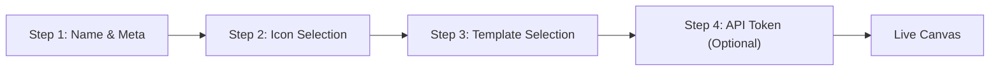
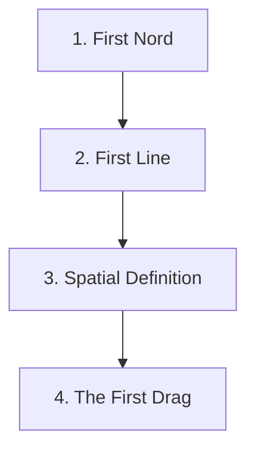

# Templates & Onboarding

> **Start with structure, not a blank canvas.** Templates package proven project architectures into reusable frameworks. Onboarding teaches the spatial paradigm in four progressive steps.

---

## Overview

Nords solves the blank-canvas problem with a layered template system. Project Templates bundle typed schemas, connection definitions, and lens configurations into reusable starting points. Component Templates define individual NordType and ConnectionType schemas that can be mixed and matched. And a four-step onboarding flow teaches new users the spatial paradigm progressively — from creating their first card to dragging their first relationship.

Templates are managed at the **workspace level**, not per-project. Updating a global template propagates schema changes across all affiliated projects, ensuring cross-organization consistency.

---

## The Problem

- **Every new project starts from scratch.** Teams waste hours rebuilding the same task types, connection schemas, and lens configurations project after project.
- **There's no way to package and share project structures.** A team lead who builds a great project graph can't give that architecture to another team without manual recreation.
- **New users face a cold start.** A spatial graph engine is powerful but unfamiliar — without guided onboarding, users stare at an empty canvas and don't know where to begin.
- **Schema inconsistency across projects.** Without centralized type management, every project invents its own vocabulary for the same concepts.

---

## User Stories

| # | Persona | Story |
|---|---------|-------|
| 1 | **Workspace Admin** | As an admin, I want to promote a successful project into a system-wide template so other teams can start with proven structures instead of building from zero. |
| 2 | **Product Manager** | As a PM, I want to select a "Multi-Dimensional PM" template during project creation so I immediately get Task, Bug, and Milestone types with Blocker and Assignment connections pre-configured. |
| 3 | **New User** | As a first-time user, I want the onboarding flow to teach me what "distance means data" through a hands-on drag interaction — not a tutorial video. |
| 4 | **Strategy Lead** | As a strategist, I want to load the Strategic Alignment (OKRs) template with sample data so I can demo the spatial paradigm to stakeholders before building real content. |
| 5 | **Engineering Lead** | As an eng lead, I want workspace-level type libraries so that when I update a "Task" NordType definition, the schema change propagates to every project using it. |

---

## Key Capabilities

| Capability | Description |
|-----------|-------------|
| **4-Step Project Initialization** | Guided flow from naming through template selection to optional API token generation. |
| **Component Templates** | Standalone NordType and ConnectionType schemas — the building blocks. |
| **Project Templates** | Pre-packaged bundles of Component Templates with lens configurations and optional sample data. |
| **Global Schema Management** | NordTypes and ConnectionTypes live at the workspace level. Projects reference them; updates propagate globally. |
| **Promote to Template** | Admins can elevate any live project into a reusable template, stripping operational data or caching it as sample data. |
| **Sample Data Injection** | Toggle to populate a new project with a mock graph so users can immediately interact with physics and lens transitions. |
| **Progressive Onboarding** | Four-step hands-on flow that teaches the spatial paradigm through direct interaction, not passive reading. |

---

## Project Initialization Flow

When creating a new project, users progress through four steps before reaching the live canvas:

| Step | What Happens |
|------|-------------|
| **1. Project Naming & Meta** | Assign a project name and description. |
| **2. Icon Selection** | Choose from the Lucide icon library. The icon appears in the project switcher and header. |
| **3. Template Selection** | Choose a pre-built framework from the Template Library, or select **Blank Canvas** to build custom structures. Optionally toggle "Load with Sample Data." |
| **4. API Token Generation** | An [[Access Tokens|access token]] is auto-generated for MCP integrations. Token scope (Read-Only / Read-Write / Admin) can be adjusted later in Project Settings. |

---

## Template Hierarchy

Templates are strictly divided to prevent confusion:

### Component Templates (Building Blocks)

Metadata schemas for individual NordTypes and ConnectionTypes. They define:
- Color, icon, and property fields
- Stage labels and breakpoint positions
- Default direction settings (for ConnectionTypes)

Component Templates contain **no user content** — they are pure structure.

### Project Templates (Bundled Architectures)

A Project Template packages:
- A specific set of Component Templates (NordTypes + ConnectionTypes)
- Pre-configured Lens settings (default view, active connection type)
- Optional sample data (a pre-built, fully connected mock graph)

When a user selects a Project Template at creation time, all bundled Component Templates are injected into the project and the canvas is pre-configured.

---

## Global Schema Management

NordType and ConnectionType schemas are **not siloed** within individual projects:

- **Workspace-Level Libraries:** The "Nord-Builder" (for NordTypes) and "Line Library" (for ConnectionTypes) exist at the workspace level.
- **Project Palettes:** Inside a project, users access a "Nord Palette" and "Connections Palette" that filter the global libraries. Types can be activated or deactivated per project.
- **Global Propagation:** Updating a type definition globally propagates the schema change to all projects using that type.

### Promote to Template

Global Admins can elevate any live project into a system-wide template:

1. Navigate to the project's **Settings** panel.
2. Click **"Save as System Template."**
3. The system strips raw operational data (or caches it as explicitly marked Sample Data).
4. It extracts the blend of Component Templates and Lens Settings.
5. The resulting framework is published to the **Global Template Library** for all users.

---

## Standard Template Library

Four initial templates demonstrate the engine's versatility and solve the "what do I build?" problem:

### 1. Strategic Alignment (OKRs)

| Aspect | Detail |
|--------|--------|
| **Concept** | Visualize company goals and surface "orphan" work |
| **NordTypes** | Objectives, Key Results, Initiatives |
| **ConnectionTypes** | Alignment, Contribution |
| **Key Mechanic** | Initiatives must connect to Key Results. Disconnected work floats to the canvas edges, immediately highlighting rogue projects with no strategic link. |

### 2. Narrative Geometry (Storyboarding)

| Aspect | Detail |
|--------|--------|
| **Concept** | Map emotional and physical geometry using Snapshots as scenes |
| **NordTypes** | Characters, Props, Settings, Plot Points |
| **ConnectionTypes** | Emotional Tension, Physical Proximity, Alliance |
| **Key Mechanic** | Duplicate Snapshots to move chronologically. Drag characters between scenes to dynamically update narrative tension values. |

### 3. Multi-Dimensional Project Management

| Aspect | Detail |
|--------|--------|
| **Concept** | View identical project data through different operational lenses |
| **NordTypes** | Tasks, Bugs, Milestones, Team Members |
| **ConnectionTypes** | Blockers (Dependencies), Assignments |
| **Key Mechanic** | Toggle connection visibility to reorganize the canvas — switch from an "Assigned To" cluster to a linear "Blocker" dependency chain via physics. |

### 4. Visual Vector RAG (AI Knowledge Mapping)

| Aspect | Detail |
|--------|--------|
| **Concept** | Demystify AI retrieval by mapping vector embeddings spatially |
| **NordTypes** | Document Chunks, Queries, AI Agents |
| **ConnectionTypes** | Semantic Similarity (Cosine Distance) |
| **Key Mechanic** | Place a Query Nord and watch relevant Document Chunks snap tighter. Manually tweak the RAG context window by dragging documents in or out of the Query's gravity well. |

---

## Onboarding Flow (Progressive Complexity)

New users learn the spatial paradigm through four hands-on steps — each builds on the last:

| Step | What the User Does | What They Learn |
|------|-------------------|-----------------|
| **1. First Nord** | Create the first card natively — name it, give it a type. | Nords are typed entities with structured properties. |
| **2. First Line** | Define the first relationship manually ("Depends on", "Is Led By"). | Connections are typed edges — you define the vocabulary. |
| **3. Spatial Definition** | Tell the system what distance means for that connection ("Closer means more important"). | Distance encodes meaning. The 0.0–1.0 scale maps to stage labels. |
| **4. The First Drag** | Drag Nord B toward Nord A and watch the data update. | Physical position *is* the data. The visual and the database are one. |

> [!TIP]
> Selecting a template with **Sample Data** at project creation provides an alternative onboarding path — users can explore a fully built graph immediately and learn by interaction rather than construction.

---

## Technical Notes

- **Template Storage:** Templates are stored at the workspace level in the database. Project creation references template IDs to inject Component Templates and Lens Settings.
- **Schema Propagation:** When a global type is updated, the system propagates the change to all affiliated projects. Soft deletes ensure historical snapshots aren't corrupted. See [[Data Model]].
- **RBAC:** Only Global Admins can create or promote system templates. Standard users can create projects from existing templates.
- **Source:** `server/src/repositories/` handles template CRUD; `docs/product/06_admin_and_templates.md` contains the full specification.
- **Related pages:** [[Property-Types]], [[Data Model]], [[Architecture]], [[Glossary]]
